<div align="center">


# OpsHub

**Role-based, multi-branch operations management — for any business.**

Task assignment with proof · GPS attendance · weekly scheduling &amp; shift swaps · approvals · branch administration · live operations dashboards.

<br/>


-1E1E24?style=flat-square&labelColor=0A0A0B)


</div>

---

## Overview

**OpsHub** is a **role-based operations management platform for multi-branch
businesses** — one app to run tasks, attendance, scheduling, approvals, and
communications across every branch. It is deployed as an internal tool: access is
**admin-provisioned**, with no public sign-up. Three roles run the whole system:

| Role | Scope |
| --- | --- |
| 🛡️ **Admin** | Global. Provisions accounts, works across every branch, does everything a manager can. |
| 🧭 **Manager** | Exactly one branch. Assigns and reviews work, approves swaps and requests, watches coverage. |
| 👤 **Employee** | Own work only. Executes tasks with proof, clocks in/out by GPS, requests swaps and approvals. |

Authentication is **admin-provisioned** — an admin creates each account via a Cloud
Function; there is no public registration, OTP, or social sign-in. First login walks a
deterministic gate: **force password change → profile completion → one-time welcome →
role home**.

---

## Screenshots

<sub>Captured on iOS · dark, monochrome by design.</sub>

<table>
  <tr>
    <td width="33%" align="center">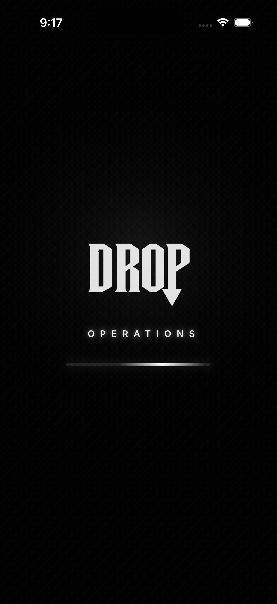<br/><sub><b>Launch</b> · the branded cold start</sub></td>
    <td width="33%" align="center">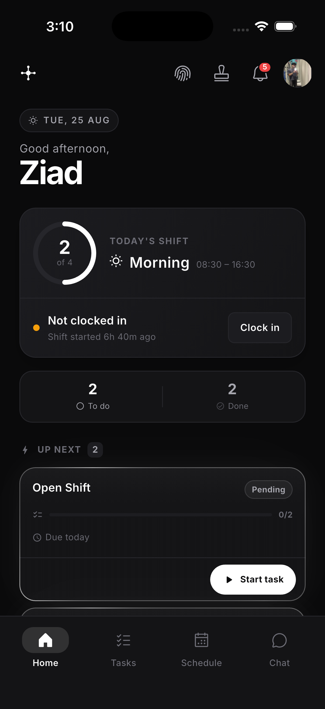<br/><sub><b>Employee Home</b> · shift, tasks &amp; clock-in</sub></td>
    <td width="33%" align="center">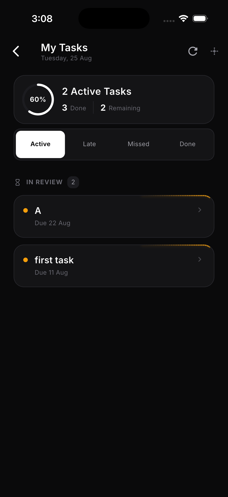<br/><sub><b>My Tasks</b> · active · late · missed · done</sub></td>
  </tr>
  <tr>
    <td width="33%" align="center">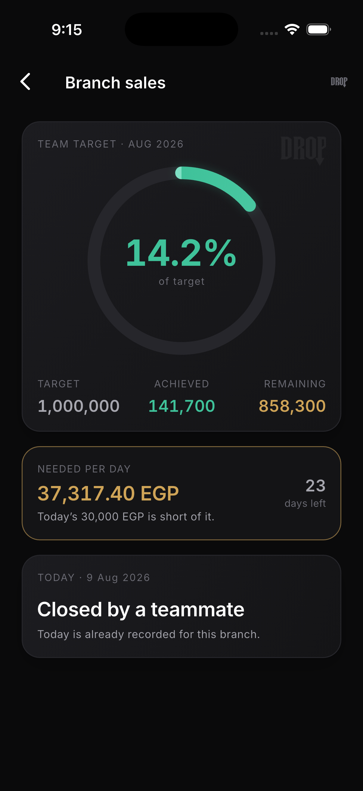<br/><sub><b>Branch Sales</b> · monthly target &amp; pace</sub></td>
    <td width="33%" align="center">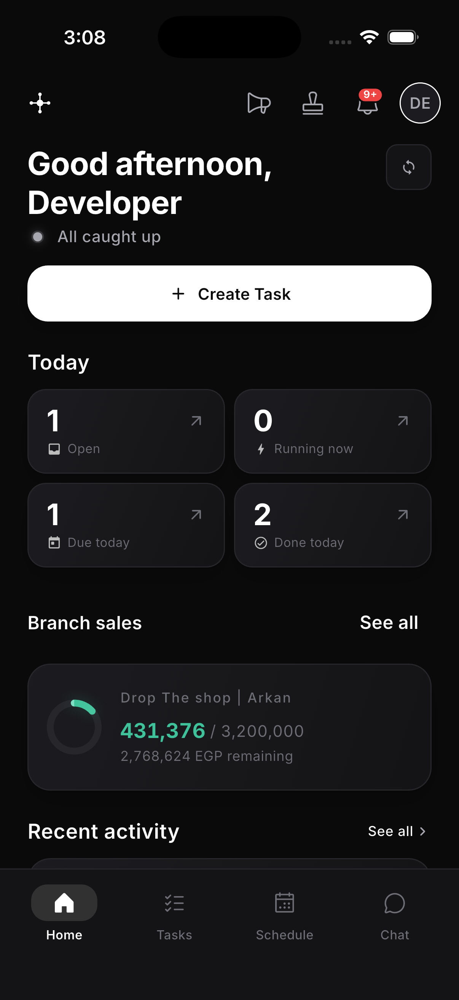<br/><sub><b>Manager Home</b> · today at a glance</sub></td>
    <td width="33%" align="center">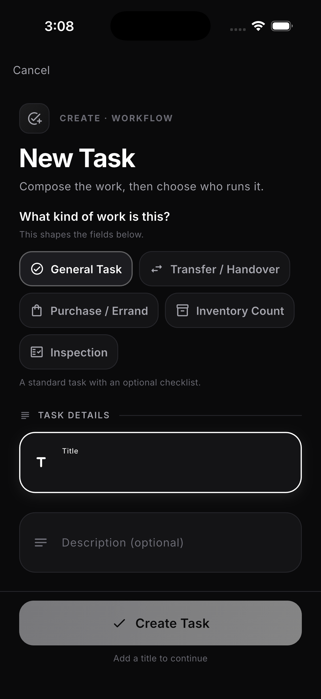<br/><sub><b>New Task</b> · compose the work</sub></td>
  </tr>
  <tr>
    <td width="33%" align="center">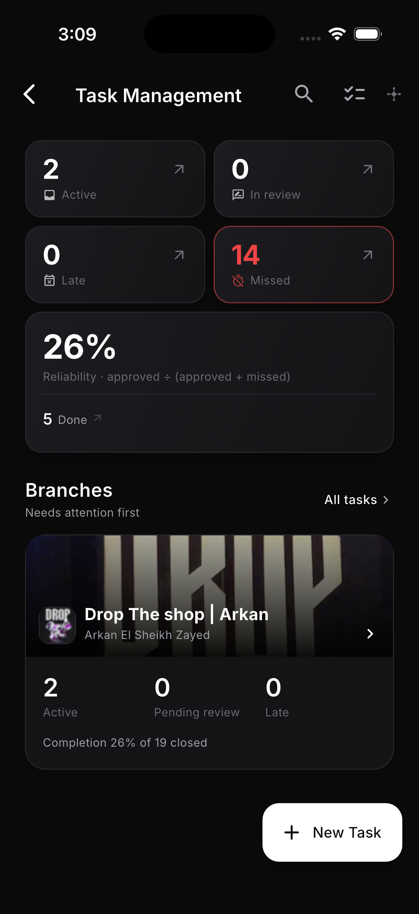<br/><sub><b>Task Management</b> · cross-branch command</sub></td>
    <td width="33%" align="center">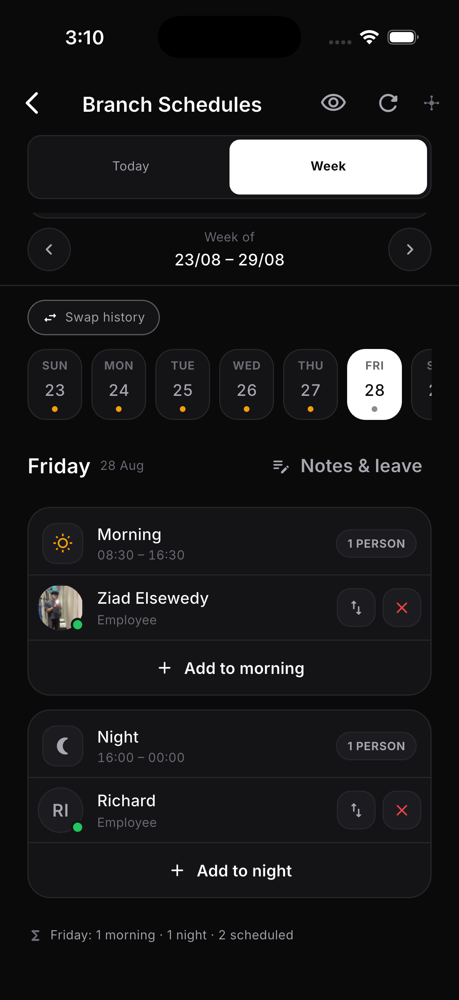<br/><sub><b>Branch Schedules</b> · weekly roster &amp; swaps</sub></td>
    <td width="33%" align="center">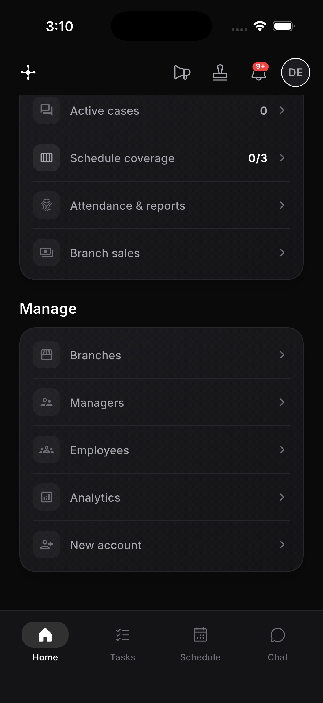<br/><sub><b>Admin Command Center</b> · manage everything</sub></td>
  </tr>
  <tr>
    <td width="33%" align="center">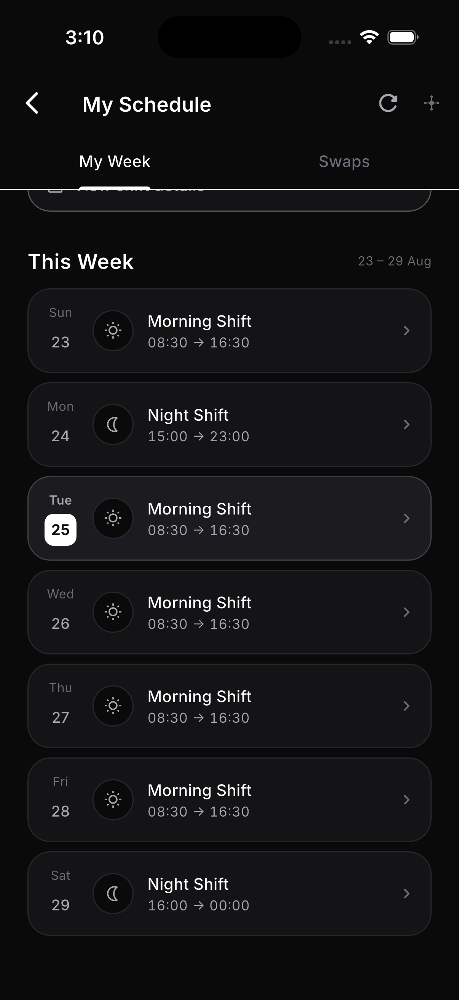<br/><sub><b>My Schedule</b> · the week ahead</sub></td>
  </tr>
</table>

---

## Design philosophy

OpsHub is deliberately **lean but premium**. The rules below are load-bearing — most are
backed by an [Architecture Decision Record](docs/decisions/).

- **Workflow over architecture. UX over feature count.** Default to *deletion* — the burden
  of proof is on *keeping* a feature, not cutting it. Whole subsystems (Schedule Health, an
  analytics pipeline) were shipped and then removed.
- **Premium, not minimal.** Strictly **monochrome, dark-mode-only**. White is the only
  accent; colour is reserved for `success` / `error` / `warning` / `info` **status**. Calm
  comes from a 4-step grey ramp and hierarchy, not from stripping things out.
- **The brand is an experience, not a logo.** A cinematic cold start — splash, then the
  pre-login **landing page** (hero mark, positioning, live app showcase) — sets the tone
  before any credentials appear. The hub mark, the tracked `OPERATIONS` line, and restrained
  light-sweep motion carry through every surface: launcher icon, auth, chrome, and page
  entrances.
- **Simple &gt; clever. Stability &gt; perfection.** No abstraction without a second caller; 90%
  done with **zero regressions** beats 100% done with risk.
- **Every state is a finished state.** Empty, loading, error, and offline each have a
  first-class, reusable surface — never a bare spinner or a broken box.

---

## Features

| Module | What it does |
| --- | --- |
| ✅ **Tasks** | Operations tasks: create → execute (with proof) → review. Templates and recurring shift-task automation. |
| 🗓️ **Schedule** | Admin cross-branch *Today* coverage, weekly roster, shift templates, leave, and attributed swap approval/history. |
| 📍 **Attendance** | GPS-verified clock in/out with geofences, corrections, and an admin board. |
| 🙋 **Requests** | Lightweight employee → manager yes/no approvals. |
| 💬 **Cases** | Private employee ↔ manager/admin conversations. |
| ✉️ **Chat** | Direct 1:1 staff chat over a NestJS API with Socket.IO realtime and an offline SQLite cache *(in progress)*. |
| 📢 **Communications** | Broadcasts, templates, schedules, and reminders. |
| 💰 **Sales** | Per-branch monthly sales targets, daily employee closes, manager approval, and derived pace KPIs *(opt-in per branch)*. |
| 🏬 **Operations** | Branch operations cockpit — workload and KPI drill-downs. |
| 🔔 **Notifications** | Notification inbox with deep-link resolution. |
| ⚙️ **Admin &amp; Branch** | User administration, branch CRUD, geofences, and policy configuration. |
| 📊 **Statistics** | Role-scoped counts powering all three dashboards. |

19 feature modules in [`lib/features/`](lib/features/); one design spec each in
[`docs/design/`](docs/design/).

---

## Tech stack

| Concern | Choice |
| --- | --- |
| Language / UI | Dart `^3.12.1` · Flutter |
| State | `flutter_bloc` — **Cubits only** |
| Navigation | `go_router` — auth-aware redirects + role guards |
| Backend | Firebase: Auth · Firestore · Storage · Cloud Messaging · **31 Cloud Functions** |
| Chat API *(in progress)* | NestJS over `dio` + Socket.IO; offline cache via `drift` (SQLite) |
| Models | `freezed` + `json_serializable`, generated with `build_runner` |
| Location | `geolocator` (attendance GPS) |
| Media | `image_picker` · `image_cropper` · `video_compress` |

**Platforms:** iOS · Android · macOS. Desktop is a **first-class target**, not an afterthought.

---

## Architecture

**Clean Architecture, sliced by feature.** The dependency rule always points **inward** —
`presentation → domain ← data`. `domain/` is pure Dart and imports neither Flutter nor
Firebase, which is why the full **1963-test** suite runs in **~40s** with no Firebase and no
live backend: the business rules are pure functions.

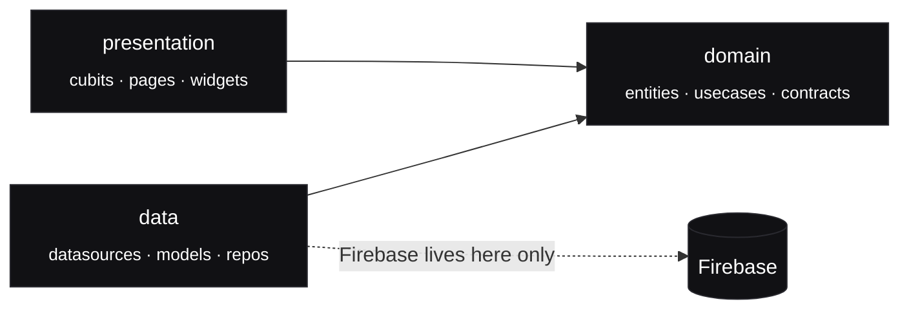

```
lib/
├── core/                 # Feature-neutral: theme · routing · DI · network · widgets
└── features/<feature>/
    ├── data/             # The ONLY place Firebase exists (datasources · models · repositories)
    ├── domain/           # Pure Dart — never imports Flutter or Firebase (entities · repositories · usecases)
    └── presentation/     # Cubits · pages · widgets (sees entities only)
```

Dependencies are wired **by hand** in
[`lib/core/di/injection.dart`](lib/core/di/injection.dart) — no DI package. Full rationale
lives in the [Architecture Decision Records](docs/decisions/).

---

## Getting started

**Prerequisites:** Flutter with Dart `^3.12.1`, and the Firebase CLI for backend work.

```bash
flutter pub get
flutter run
```

After changing any `freezed` entity or state, regenerate code:

```bash
dart run build_runner build --delete-conflicting-outputs
```

### Verify

```bash
flutter analyze     # expect: clean (1 pre-existing info)
flutter test        # expect: 1963 tests, all green
```

> A handful of sales-dashboard / overlay widget tests are **date-sensitive** (they judge
> month pace) and can read red in the final days of a month — confirm they fail on a clean
> checkout too before treating a red as your regression.

If you touch `firestore.rules`, also run the rules suite (the Dart tests never evaluate a
rule):

```bash
cd firestore-tests && npm test   # needs the Firebase CLI + a JDK
```

And after any change under `functions/`:

```bash
cd functions && node --test
```

---

## Firebase

Auth · Firestore · Storage · Cloud Messaging · Cloud Functions back the app; the backend
contract is [`docs/design/DATA_MODEL.md`](docs/design/DATA_MODEL.md). Server logic lives in
[`functions/`](functions/).

```bash
firebase deploy --only functions,firestore:rules,firestore:indexes,storage
```

> ⚠️ **Read [CURRENT_STATE.md](CURRENT_STATE.md) before shipping.** Some rules, indexes, and
> functions may be undeployed at any given time — an undeployed change is inert in production
> and fails at *runtime*, not compile time.

---

## Documentation

Each document has **one** responsibility. Start at **PROJECT_CONTEXT**; follow a link only
when the task needs it.

| Document | Answers |
| --- | --- |
| [PROJECT_CONTEXT.md](PROJECT_CONTEXT.md) | **How is this built?** Architecture, module map, coding standards, UI philosophy |
| [.nav/](.nav/README.md) — *Atlas* | **Where do I go / what breaks?** Navigation for contributors and AI agents |
| [CURRENT_STATE.md](CURRENT_STATE.md) | **Where are we today?** Branches, what's done, known issues, priorities |
| [CHANGELOG.md](CHANGELOG.md) | **What happened when?** |
| [docs/design/](docs/design/) | **How does *this feature* work?** One spec per feature |
| [docs/decisions/](docs/decisions/) | **Why, and don't re-litigate.** Architecture Decision Records |
| [docs/QA.md](docs/QA.md) | **How do we verify a release?** |

**If the code and a doc disagree, the code wins** — verify against the code, then fix the doc
in the same task.

---

## Project identity

The repository folder on disk is **`OpsHub-operations`**; the Dart package is
**`opshub`** (every import is `package:opshub/…`). The product has a single user-facing
name, **`OpsHub`**, used everywhere — the OS launcher/window label on every platform,
the in-app wordmark, splash, About, notifications, and all in-app copy.

Platform **bundle identifiers are deliberately unchanged** — `com.ziad.drop` (iOS/macOS)
and `com.example.dropoperation` (Android) — because they are registered with Firebase;
renaming them requires re-registering the apps in the Firebase console first.

> This is a private package (`publish_to: none`) and is **not** distributed on pub.dev.

<div align="center">
<br/>
<sub>Built with Flutter · Firebase · Clean Architecture.</sub>
</div>
