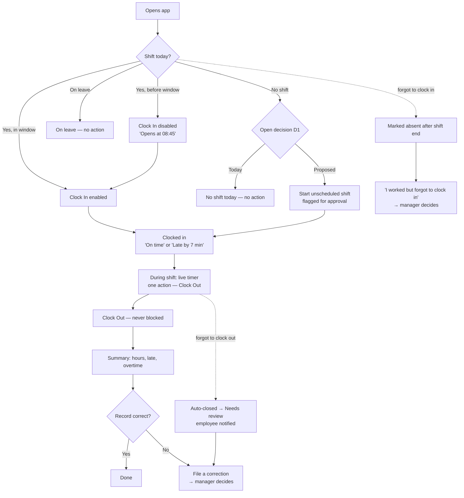
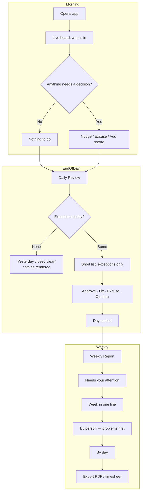
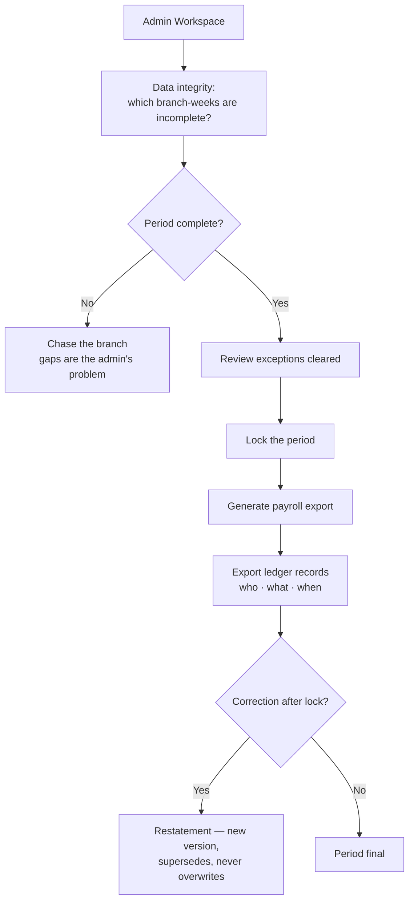
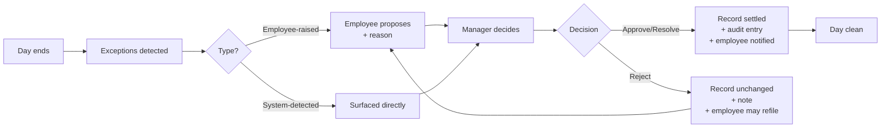
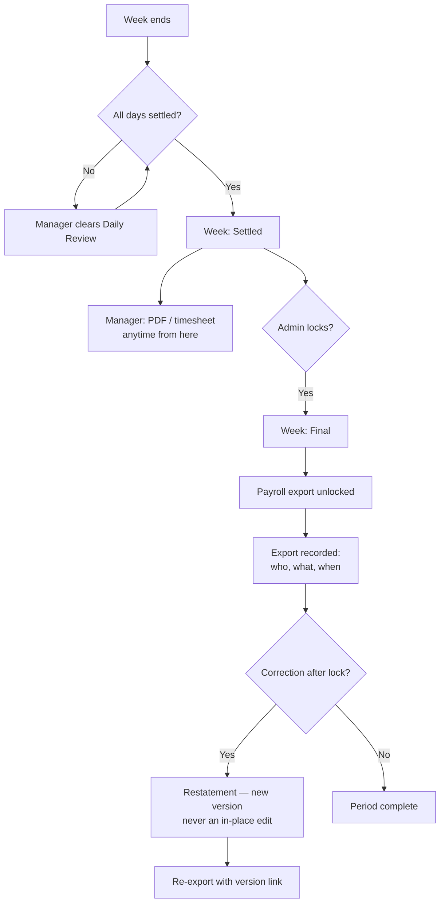
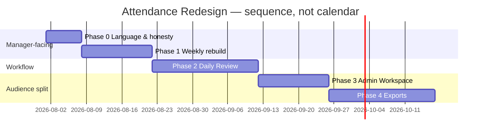
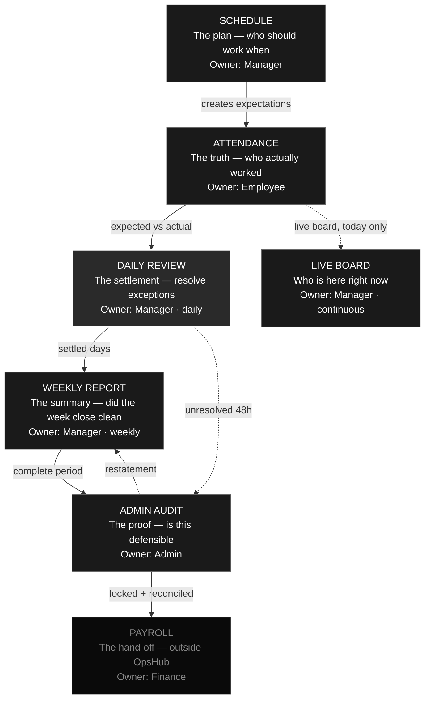

# OpsHub Attendance — Product Redesign Plan

> **Status:** DRAFT — proposed, not yet accepted. Awaiting owner sign-off on §11.
> **Date:** 2026-07-31 · **Author:** Product · **Type:** PRD + implementation roadmap
>
> **Scope of authority.** On acceptance this document becomes the canonical product
> specification for the **presentation and workflow layer** of Attendance: what each
> role sees, in what order, in what language, and which decision each surface drives.
>
> **What it does not touch.** The attendance *engine* — the state machine, the
> business rules, the minute math, and the edge-case rulings in
> [ATTENDANCE_SPEC.md](ATTENDANCE_SPEC.md) — is unchanged and still wins on
> behaviour. The ledger scope carve-out in
> [ADR-017](../decisions/ADR-017-attendance-reporting-ledger.md) is unchanged and
> still governs what may be computed. This document changes **who sees what**, not
> **what is true**.
>
> **Relationship to [ATTENDANCE_REPORTS_IA.md](ATTENDANCE_REPORTS_IA.md).** That
> document is the current information architecture. §7 and §8 below **amend** it.
> Where the two disagree, this document wins on report structure, section
> inventory, metric selection, and audience placement. Everything the IA says about
> routing, period math, close inputs, and the export matrix survives intact.

---

## Table of contents

1. [Executive Summary](#1-executive-summary)
2. [Current State Analysis](#2-current-state-analysis)
3. [Product Principles](#3-product-principles)
4. [Complete User Journeys](#4-complete-user-journeys)
5. [Attendance Engine — Business Rules](#5-attendance-engine--business-rules)
6. [Daily Review (NEW)](#6-daily-review-new)
7. [Weekly Report Redesign](#7-weekly-report-redesign)
8. [Admin Workspace](#8-admin-workspace)
9. [Export Strategy](#9-export-strategy)
10. [Migration Roadmap](#10-migration-roadmap)
11. [Open Product Decisions](#11-open-product-decisions)
12. [Final Product Architecture](#12-final-product-architecture)

---

# 1. Executive Summary

## 1.1 Why we are redesigning Attendance

A real store manager was shown the Weekly Attendance Report and could not understand
most of it. He could not answer the one question the screen exists to answer: *did my
team show up this week?*

This is the redesign trigger, and it deserves to be stated precisely, because the
obvious conclusion is the wrong one. The report is not broken. It is, as far as we can
tell, **numerically correct**. It reconciles. It names its denominators. It refuses to
rank people. It is the output of a genuinely rigorous specification.

It is also **unusable by the person it was built for**.

The redesign exists to close that gap — not by making the engine less rigorous, but by
recognising that the engine's vocabulary and the manager's vocabulary are different
languages, and that we have been shipping the former.

## 1.2 Problems with the current experience

**P1 — The report speaks in implementation vocabulary.** Words currently on screen for
a store manager: *ledger*, *ledger rows*, *phantom row*, *materialized
attendance_expectations ledger fact*, *blocking*, *informational*, *exception queue*,
*close readiness*, *restatement*, *v1*. Not one of these is a word a retail manager
uses. Two of them (*phantom row*, *materialized … ledger fact*) are internal engineering
terms rendered verbatim in the product.

**P2 — Data absence is rendered as operational failure.** A week in which six of seven
days had no rostered shifts displays six amber "No ledger data" rows, a red "1" for
unexcused absences, and a **0% show-up rate**. A manager reads that as a catastrophic
week. What actually happened is that almost nothing was scheduled. *Empty*, *zero*, and
*not yet closed* are three completely different business situations and currently render
as one.

**P3 — The week is labelled "Fully closed" while 86% of it has no data.** This is not a
cosmetic issue. A status that says *closed* is a trust claim, and here it is not earned.

**P4 — The report is defensive.** It carries the sentences *"Alphabetical facts only.
This report does not rank people or compute performance scores"* and *"they are
data-completeness gaps, not attendance results."* These exist because we already knew
the screen would be misread. **When a UI has to explain what it is not, the design is
wrong.** The correct fix is to remove the need for the disclaimer, not to write a better
one.

**P5 — Most tiles read zero.** Six KPI cards; four read `0`, one reads `--`. A dashboard
where most tiles are empty teaches managers to stop opening it, and that habit is very
hard to reverse once formed.

**P6 — There is no daily layer.** Every exception in the week surfaces at once, seven
days late, inside a reporting surface, with no obvious action. The weekly report is
currently doing the job of three different screens: discovery, resolution, and summary.

**P7 — Manager and auditor share one screen.** Close state, versioning, restatement,
evidence rows, and data-completeness monitoring are all real needs — for an admin or an
auditor. They are the loudest elements on a store manager's screen.

**P8 — Ten sections where four would do.** Every section divides attention. The
manager's actual job occupies about a third of the current surface.

## 1.3 Goals

| # | Goal | How we will know it worked |
|---|---|---|
| G1 | A store manager answers "did my team show up?" in under 30 seconds, unaided | Unaided comprehension test with the same manager |
| G2 | Every word on a manager surface is a word a retail manager already uses | Zero internal terms in manager-facing copy |
| G3 | Exceptions are resolved daily, in ~2 minutes, not discovered weekly | Median exception age at week close < 24h |
| G4 | Empty, zero, and unclosed are visually and verbally distinct | No amber state for "nothing was scheduled" |
| G5 | Audit capability is preserved in full, relocated to its correct audience | No auditability regression; nothing deleted |
| G6 | The manager surface shrinks by roughly 60% | 8 sections → 5; 6 KPIs → 4 |

## 1.4 Non-goals

Explicitly **not** part of this redesign:

- **Changing the attendance engine.** The state machine, R1–R20, the workflows, and
  the edge-case rulings stay exactly as locked.
- **Reversing [ADR-017](../decisions/ADR-017-attendance-reporting-ledger.md).** The
  ledger is the right foundation. We are changing its presentation, not its scope.
- **Deleting audit capability.** Every ledger, version, and evidence surface survives.
  It moves; it does not disappear. Attendance minutes feed pay — auditability is a
  legal obligation, not a feature preference.
- **Composite employee performance scores or leaderboards.** Refused by ADR-017 and
  refused again here, for the same reason: they are gameable, they hide which behaviour
  needs action, and they invite use as discipline without context.
- **Becoming a payroll processor.** OpsHub hands off a reconciled record. It does not
  compute pay.
- **A general analytics pipeline.** ADR-009 remains active everywhere outside
  attendance reporting.
- **Multi-branch comparison and trend surfaces.** Deferred — see §11, D4. At current
  scale they have no reader.

---

# 2. Current State Analysis

## 2.1 What exists today

| Layer | State | Notes |
|---|---|---|
| Schedule → roster | Built, stable | Sunday-start week, `Africa/Cairo`, shift-hour snapshots |
| Employee clock in/out | Built | Gated on a rostered shift; GPS-verified; server-authoritative times |
| Live board ("today") | Built | Decision-ranked, exception-first. **This surface is good.** |
| History ledger | Built | Self view + branch review view, record detail with audit timeline |
| Corrections & approvals | Built | Employee files, manager decides; manager direct-resolve; no self-approval |
| Auto-close | Built | Forgot-clock-out and 16h max-session both close to Pending Review |
| Server close pipeline | Built, deployed | Materialises durable expected-shift rows per closed rostered slot |
| Reports hub | Built | Manager/admin entry point |
| **Weekly Report** | **Built — the subject of this redesign** | 8 sections, 6 KPIs |
| Daily Close | **Specified, not built** | Already designed in the IA |
| Exception Queue | **Specified, not built** | Already designed in the IA, as *"the daily workflow"* |
| Monthly / per-employee / pay-period / branch comparison | Specified, not built | See §11, D4 |
| Exports | Specified, not built | PDF, CSV, payroll |

## 2.2 What is working well

It is important to be precise about this, because the redesign preserves all of it.

1. **Schedule-anchored attendance is the correct architecture.** Attendance without a
   schedule is a timeclock — a commodity. Attendance *against* a schedule is workforce
   management, and the expected-vs-actual delta is where the entire commercial value of
   this category lives. This decision should not be revisited.
2. **The live board is genuinely well designed.** It ranks by what needs a decision,
   it treats KPIs as filters rather than vanity numbers, and it refuses trend chrome.
   §8.1 of the locked spec is a model for what the report layer should have been.
3. **The engine is honest.** Server-authoritative time, config snapshotted at the punch
   so history cannot be rewritten, one calculator as the only minute-math source,
   derived rather than persisted lateness. These are the decisions that make a record
   defensible in a dispute, and they were made correctly and early.
4. **No dead ends.** Every real-world failure — forgot to punch, lost GPS, overnight
   session left open — has exactly one defined path back to a settled state. This is
   rarer in workforce products than it should be.
5. **The ledger/scoreboard distinction is a genuinely good call.** ADR-017's metric bar
   (formula · denominator · owner · gameability · the decision it changes) is more
   rigorous than most commercial products apply, and it is why this redesign can be a
   presentation change rather than a rebuild.
6. **The daily layer was already designed.** Daily Close and the Exception Queue exist
   in the IA. The problem is sequencing, not conception.

## 2.3 What is confusing

Ranked by observed severity:

1. Vocabulary that has no meaning outside the codebase (P1)
2. Data gaps rendered in alarm colours (P2, P3)
3. Six KPIs, most reading zero, none matching a manager's actual accountability (P5)
4. No visible action anywhere on the screen — it is entirely read-only
5. Audit machinery competing with operational content for the same attention (P7)
6. Alphabetical sorting, which buries the one person who did not show up

## 2.4 Root causes

**RC1 — The screen is a faithful build of its own specification.** This is the finding
that matters most. `ATTENDANCE_REPORTS_IA.md` §6.4 specifies precisely eight sections —
header, close readiness, metric strip, daily rhythm, exception summary, employee rows,
evidence table, export/restatement — and §6.5 specifies precisely those six KPIs. **The
implementation matched the spec exactly.** No engineer erred. Therefore no amount of
screen-level fixing is durable: the spec would regenerate the same screen. *The
specification is the artefact that must change first.*

**RC2 — The build order was violated.** The IA's own sequencing lists Branch Workspace
as step 3, Exception Queue as step 4, and Weekly Report as step 5. Steps 3 and 4 were
skipped. Weekly therefore inherited responsibilities designed for a daily surface —
which is exactly why it carries close readiness, blocking/informational severity
grouping, and an evidence table.

**RC3 — The document that defined the reports was written from the ledger outward.**
ADR-017 correctly established that attendance is a ledger. The IA then, understandably,
adopted the ledger's vocabulary as the product's vocabulary. But ADR-017 governs *what
is computed and whether it is trustworthy*. Nothing in it requires that the manager read
the ledger's field names. The leap from "this is a ledger" to "the manager sees a
ledger" was never a decision anyone consciously made — it happened by inheritance.

**RC4 — Correctness was optimised in place of decision-support.** The report clears a
harder bar (it reconciles, it names denominators, it refuses to rank) while missing an
easier and more important one (a manager can act on it). Those are different quality
standards, and we hit the wrong one first.

**RC5 — The disclaimers were a signal we did not read.** The defensive copy was added
because someone already sensed the screen would be misinterpreted. That instinct was
correct; the response — explain harder — was the wrong remedy.

## 2.5 Lessons learned from real manager feedback

**L1 — The manager was not failing to understand a good report. He was correctly
reporting that the report is not for him.** This is the single most valuable piece of
feedback the module has received, and it should be treated as a finding, not a training
problem.

**L2 — Rigour and usability are independent axes.** We assumed that a defensible report
would be a useful one. It is not automatically. A report can be perfectly correct and
completely undecidable.

**L3 — Internal vocabulary escapes through specifications, not through code.** Every
leaked term on that screen was written into a design document first. The boundary needs
to be enforced at the spec layer.

**L4 — Skipping a build-order step does not defer the work, it relocates it.** The
exception-handling responsibility did not wait for the Exception Queue; it landed in
Weekly and made Weekly incoherent.

**L5 — Test comprehension with a real manager before the surface is built, not after.**
The wireframes in the IA would have failed the same test at a fraction of the cost.

**L6 — A defensive sentence in a UI is a design smell.** Treat any copy explaining what
a screen is *not* as a bug report against that screen.

---

# 3. Product Principles

These govern every Attendance surface from acceptance onward. When two conflict, the
lower number wins. They sit *beneath* the five philosophy principles in
[ATTENDANCE_SPEC.md](ATTENDANCE_SPEC.md) §1, which remain supreme.

### PP1 — Managers make decisions; they do not read implementation details.

Every element on a manager surface earns its place by changing what the manager does. A
number that cannot change a decision is decoration, regardless of how correct it is.

### PP2 — Daily operations before weekly reporting.

Problems are resolved on the day they occur, in a surface designed for resolution. The
weekly report summarises settled facts. A report is not a place to discover problems for
the first time.

### PP3 — Business language over technical language.

The product speaks the language of a retail store: *shift*, *late*, *absent*, *hours*,
*overtime*, *approve*. Internal vocabulary — ledger, row, materialise, phantom,
restatement, exception class — is legitimate in the engine and in admin surfaces, and
never appears in front of a store manager.

### PP4 — Operational UX and audit UX are separate products with separate audiences.

They share data and share nothing else. Audit is deliberate, reached on purpose, dense,
and complete. Operations is glanceable, ranked by urgency, and ruthlessly incomplete.
Merging them produces a surface that serves neither.

### PP5 — Reports answer business questions, not database questions.

*"Did my team show up?"* is a business question. *"How many ledger rows materialised?"*
is a database question. Both may be answerable; only the first belongs on a manager
surface.

### PP6 — Absence of data is never presented as a bad result.

*Nothing was scheduled*, *scheduled but no data captured*, and *scheduled and nobody
came* are three distinct states with three distinct visual treatments. Only the third is
an attendance result. Only the third may use an alarm colour.

### PP7 — Never block a person from recording real work.

The system's discomfort with an unexpected situation must never become the employee's
problem. Capture permissively; classify afterwards; let a human decide. This principle
is the basis for open decision D1 in §11.

### PP8 — Surfaces that show nothing, show nothing.

A section with no content does not render an empty shell. A metric that cannot be
computed does not render a tile reading `--`. Silence is a valid and desirable state.

### PP9 — Sort by what needs attention, not by what is tidy.

Alphabetical ordering is a fairness instinct, and it is the wrong one here: it buries the
one person who did not show up behind seven who did. Surfacing an exception is not
ranking a person — it is surfacing work.

### PP10 — Every metric names the decision it changes.

Inherited directly from ADR-017's metric bar, and extended: a metric must name its
formula, its denominator, its computation owner, its gameability analysis, **and the
decision it changes**. A metric that cannot name the decision does not ship, however
easy it is to compute.

---

# 4. Complete User Journeys

## 4.1 The three audiences

| Role | Their job | Time available | Primary question |
|---|---|---|---|
| **Employee** | Record my own work honestly; contest it if wrong | Seconds, twice a day | *Am I clocked in, and is my record right?* |
| **Store Manager** | Cover the floor, catch problems, get people paid correctly | ~2 min/day, ~10 min/week | *Who is here, who isn't, and what needs me?* |
| **Admin / Auditor** | Guarantee the record is defensible and hand it to payroll | Deliberate sessions | *Is this period complete, correct, and locked?* |

## 4.2 Employee journey



**Stage by stage.**

| Stage | What the employee sees | Language rule |
|---|---|---|
| Schedule | Their own week; today highlighted | "Morning shift · 09:00–17:00" |
| Clock In | One primary action, or a countdown, or a clear reason it is unavailable | Never a generic failure — always the specific cause |
| During shift | Live elapsed timer; one action: Clock Out | No metrics, no scores, no comparisons |
| Clock Out | Immediate plain-language summary | "7h 52m worked · 7 min late · no overtime" |
| Daily Review | **The employee has none.** Nothing to review. | — |
| Weekly Review | Own hours only, read-only | "This week: 4 shifts · 31h 20m" |
| Reports | Own history only | Never sees anyone else's record |
| Exports | **None.** | Employees do not export |

**Guarantees preserved from the locked spec:** the employee can always end a shift, can
always contest a record, is always told when they are marked late, and is never trapped
by any screen.

## 4.3 Store Manager journey



| Stage | Surface | Decision it drives | Time |
|---|---|---|---|
| Schedule | Schedule module | Is the floor covered? | — |
| Clock In / During shift | **Live board** (unchanged) | Who is missing *right now*? | Glances |
| Clock Out | Live board | Anything left open? | Passive |
| **Daily Review** | **NEW — §6** | What must I settle before tomorrow? | ~2 min |
| Weekly Review | **Redesigned Weekly Report — §7** | Did the week close cleanly; who needs coaching? | ~5 min |
| Reports | Weekly, per-person drill-down | Recurring pattern? | On demand |
| Exports | PDF summary, timesheet spreadsheet | Hand up the chain; reconcile | On demand |

**What the manager never sees:** ledger internals, close/lock machinery, versioning,
restatement, data-completeness monitoring, GPS coordinates, export audit trails.

## 4.4 Admin / Auditor journey



| Stage | Surface | Decision it drives |
|---|---|---|
| Schedule | Cross-branch schedule | Is every branch rostered? |
| Clock In / During shift | Branch selector on live board | Which branch needs support now? |
| Daily Review | Same as manager, any branch | Is any branch falling behind on settling days? |
| Weekly Review | Same as manager + close/lock controls | Which branch-week is not export-ready? |
| **Reports** | **Admin Workspace — §8** | Is the record defensible? |
| **Exports** | **Payroll export, post-lock only — §9** | Hand off to pay |

---

# 5. Attendance Engine — Business Rules

> This section **restates** the locked rules in business terms across four
> consequences. It introduces no new behaviour except where a row is explicitly marked
> **PROPOSED**, which means it depends on an open decision in §11.
>
> **Payroll impact** describes what the rule contributes to the reconciled hand-off.
> OpsHub never computes pay.

## 5.1 Timing constants (unchanged, from the locked spec)

| Constant | Value | Meaning |
|---|---|---|
| Early clock-in window | 15 min before start | Earliest a shift may be started |
| Late grace | 5 min | Lateness is recorded beyond this |
| Overtime grace | 15 min | Overtime is shown beyond this |
| Auto-close grace | 120 min after scheduled end | Forgotten clock-out closes for review |
| Max session cap | 16 hours | Any open session closes for review |
| Business week | Sunday–Saturday, `Africa/Cairo` | Matches the roster week |

**Recommendation (documented, not proposed for change):** these are global constants
with no per-branch override. That is correct at current scale. Revisit only when a
second branch demonstrably needs different values — not before.

## 5.2 The rules

### R-A · Scheduled shift

| | |
|---|---|
| **Immediate** | The roster creates an expectation. Before the window, the employee sees a countdown. Nothing is recorded yet. |
| **Daily Review** | An expected shift with no outcome is the primary thing Daily Review exists to settle. |
| **Weekly Report** | The expectation is the **denominator** for everything. Without it, no rate means anything. |
| **Payroll** | Defines what *should* have been worked. Payroll reconciles actual against it. |

### R-B · Late arrival

| | |
|---|---|
| **Immediate** | Beyond 5 minutes' grace the employee is told plainly at clock-in: *"You're marked late."* No silent flagging — this is what prevents disputes. |
| **Daily Review** | Not an exception. Lateness is a recorded fact, not something needing a decision. It does not enter the queue. |
| **Weekly Report** | Appears as **late arrival count** per person. Not as summed minutes — see §7.4. |
| **Payroll** | No deduction. Minutes worked are minutes worked. Lateness is a coaching signal, not a pay event. |

### R-C · Early arrival

| | |
|---|---|
| **Immediate** | Allowed inside the 15-minute window, refused before it with the exact time it opens. |
| **Daily Review** | Nothing. Never an exception. |
| **Weekly Report** | Invisible. Deliberately — showing it would imply it matters. |
| **Payroll** | **Zero.** Worked time counts from scheduled start. Arriving early never inflates hours. |

### R-D · Early leave

| | |
|---|---|
| **Immediate** | Clock-out is accepted without argument. The summary states the shortfall honestly. |
| **Daily Review** | Not an exception by default. **Recommendation:** if it recurs for the same person, that is a coaching pattern for the weekly view, not a daily interruption. |
| **Weekly Report** | Reflected inside **hours worked** — the shortfall is already visible there. Not given its own metric. |
| **Payroll** | Reduces worked minutes. Reconciles naturally. |

### R-E · Overtime

| | |
|---|---|
| **Immediate** | Derived and displayed past the 15-minute grace. Never auto-approved. |
| **Daily Review** | **Not an exception, at any size.** Visible in the day line; never a queue item. Confirming it would change no record, no payment and no export — see §5.3. |
| **Weekly Report** | A **headline KPI** — one of only four. It is the number a manager is held accountable for. |
| **Payroll** | Directly pay-relevant. Must be confirmed before export. |

### R-F · Missing punch — forgot to clock in

| | |
|---|---|
| **Immediate** | Nothing is recorded. After the shift ends the expectation shows as absent. |
| **Daily Review** | **Top-priority exception.** Two doors, both ending valid: the employee declares *"I worked but forgot to clock in"*, or the manager adds the record directly. |
| **Weekly Report** | If settled — invisible, it is just a worked shift. If unsettled — it blocks a clean close. |
| **Payroll** | Unsettled means hours are missing and someone is underpaid. This is the highest-cost exception in the system. |

### R-G · Missing punch — forgot to clock out

| | |
|---|---|
| **Immediate** | Auto-closes 120 minutes after scheduled end, into *needs review*. The employee is notified — high priority, one of only three high-priority notifications. |
| **Daily Review** | **Exception.** Employee proposes the real time, or the manager resolves directly with a reason. |
| **Weekly Report** | Same as R-F: settled is invisible, unsettled blocks close. |
| **Payroll** | Auto-closed minutes are **not** payroll-trustworthy until confirmed. Must clear before export. |

### R-H · No-show

| | |
|---|---|
| **Immediate** | The live board flags it during the shift so the manager can react while it still matters — this is coverage, not reporting. |
| **Daily Review** | **Exception.** Confirm unexcused, or excuse it with a reason. |
| **Weekly Report** | A **headline KPI**, with the person's name attached. Never an anonymous count. |
| **Payroll** | Zero hours. An unexcused no-show that was never confirmed is a data gap, not a zero — the distinction matters for a dispute. |

### R-I · Excused absence

| | |
|---|---|
| **Immediate** | Only exists once a manager acts. Requires a reason — mandatory, never optional. |
| **Daily Review** | The *outcome* of resolving a no-show, not an exception itself. |
| **Weekly Report** | Shown separately from unexcused absence. **These must never be summed.** |
| **Payroll** | Zero worked minutes, but categorically different from an unexcused absence. Leave policy may treat it differently. |

### R-J · Unscheduled shift — **ACCEPTED, [ADR-018](../decisions/ADR-018-unscheduled-clock-in.md)**

| | |
|---|---|
| **Immediate (was)** | Refused. No roster entry, no clock-in — the employee could not record real work. |
| **Immediate (accepted)** | **Accepted and flagged.** A deliberate secondary action with a mandatory reason; the full GPS gate applies. The punch lands, tagged as unscheduled. |
| **Daily Review** | **Exception:** approve as worked, attach to a shift, or reject with a reason. |
| **Weekly Report** | Approved unscheduled shifts count in hours. Unapproved ones block close. |
| **Payroll** | Only approved unscheduled work is exported. Never auto-included. |

*Note: the server already handles unscheduled open sessions via the 16-hour cap — the
backend contemplates a case the client cannot currently produce.*

### R-K · Shift edited after the fact

| | |
|---|---|
| **Immediate** | The configuration snapshotted at the punch wins. A later roster edit never rewrites a recorded shift. |
| **Daily Review** | An edit to a *future* shift is invisible. An edit to a *settled* one produces a correction, not a silent change. |
| **Weekly Report** | A closed week's denominator is frozen. Editing an old roster must never move a signed-off number. |
| **Payroll** | Non-negotiable. A pay-relevant figure that moves after sign-off destroys trust in the entire record. |

### R-L · Manual correction

| | |
|---|---|
| **Immediate** | Employees *request*; managers *act*. Self-approval is impossible. At most one open correction per record. |
| **Daily Review** | Pending corrections are the **first group** in the queue — someone is waiting. |
| **Weekly Report** | Open corrections block a clean close. Resolved ones are invisible to the manager and permanent in the audit trail. |
| **Payroll** | A corrected record is the payroll-authoritative one. Post-lock corrections become restatements — see §8. |

## 5.3 Exception taxonomy — the complete set

Six exception types. Everything else is a fact, not an exception. Presented in Daily
Review in this order:

| # | Type | Why it needs a human | Manager actions |
|---|---|---|---|
| 1 | Pending correction | A person is waiting on a decision | Approve · Reject with note |
| 2 | Missing clock-in | Real work may be unrecorded | Add record · Mark absent · Excuse |
| 3 | Missing clock-out | Hours are unknown | Confirm time · Resolve directly |
| 4 | No-show | Coverage failed | Confirm unexcused · Excuse with reason |
| 5 | Unscheduled work | Not planned, may be legitimate | Approve · Reject |

**Deliberately not exceptions:** lateness (a fact), early arrival (irrelevant), early
leave (visible in hours), normal overtime under threshold, and every GPS observation.
Each was considered and each fails PP1 — none changes what the manager does today.

---

# 6. Daily Review (NEW)

> Designed in [ATTENDANCE_REPORTS_IA.md](ATTENDANCE_REPORTS_IA.md) §8.1 and §10 as
> *Daily Close* and *Exception Queue*. This section consolidates them into a single
> manager-facing surface and settles the product design. **This is the most important
> deliverable in the redesign.**

## 6.1 Purpose

**One sentence:** Daily Review is where a store manager settles yesterday in two
minutes, so that nothing is ever discovered for the first time in a weekly report.

It exists because of a structural problem: the weekly report is currently trying to be
three products simultaneously — a discovery tool, a resolution tool, and a summary. It
cannot be all three. Daily Review takes discovery and resolution. Weekly keeps summary,
and becomes simple as a direct consequence.

**Why daily and not weekly:**

- **Memory.** A manager remembers yesterday. Nobody reliably reconstructs the previous
  Tuesday.
- **Volume.** One day for one branch produces zero to three exceptions. A week produces
  a pile that reads as failure.
- **Cost.** An unrecorded shift found the next morning is a two-minute fix. Found on
  Friday, it is an argument about pay.
- **Trust.** A manager who clears a short list daily believes the weekly number. One
  who is handed a backlog does not.

## 6.2 Information architecture

Three zones, fixed order, no configuration:

```
┌──────────────────────────────────────────────────────┐
│  Thursday 30 July · Drop The Shop                    │
│  3 things need you                          [Done]   │
├──────────────────────────────────────────────────────┤
│  ZONE 1 — NEEDS YOU                                  │
│  ▸ Sara didn't clock out — shift ended 17:00         │
│      [Set the time]  [Resolve myself]                │
│  ▸ Ahmed was scheduled but never clocked in          │
│      [He worked]  [He was absent]  [Excuse]          │
│  ▸ Mona requested a time change: 09:00 → 08:30       │
│      [Approve]  [Reject]                             │
├──────────────────────────────────────────────────────┤
│  ZONE 2 — THE DAY                                    │
│  6 of 7 shifts worked · 47h 10m · 1h 20m overtime    │
│  2 late arrivals                                     │
├──────────────────────────────────────────────────────┤
│  ZONE 3 — EVERYONE (collapsed)                       │
│  ▸ Show all 7 shifts                                 │
└──────────────────────────────────────────────────────┘
```

**Zone 1 — Needs you.** The only zone with verbs. Ordered by cost of being wrong:
pending corrections (a person is waiting) → missing clock-in (unrecorded work) →
missing clock-out (unknown hours) → no-show → unusual overtime → unscheduled work. Every
row names a person, states a plain-language fact, and offers two or three actions
inline. **Never a severity label** — no *blocking*, no *informational*, no *class*.
Order communicates priority; a taxonomy does not need to be shown to be used.

**Zone 2 — The day.** Four facts, one line. Confirmation, not analysis.

**Zone 3 — Everyone.** Collapsed by default. The full roster with outcomes, for the
manager who wants to check a specific person. Opened deliberately, never in the way.

## 6.3 Manager actions

| Exception | Actions | Requires reason? |
|---|---|---|
| Pending correction | Approve · Reject | Reject: **yes** |
| Missing clock-in | Add record · Mark absent · Excuse | Add record: yes. Excuse: yes |
| Missing clock-out | Set the time · Resolve myself | Resolve: **yes** |
| No-show | Confirm absent · Excuse | Excuse: **yes** |
| Unusual overtime | Confirm · Flag | Flag: yes |
| Unscheduled work *(proposed)* | Approve · Attach to shift · Reject | Reject: **yes** |

**Every action is one tap plus, where required, a reason.** A reason is mandatory
wherever a manager overrides what the system recorded — this is what makes the record
defensible later, and it is the manager's only cost for holding authority over their
branch.

**Deliberately absent:** bulk "approve all". It exists in the IA (§10.4) and should not
ship. At zero-to-three exceptions a day it saves nothing, and it converts a considered
decision into a reflex on records that feed pay. Reconsider only if a branch routinely
exceeds ten exceptions a day — which would itself be the real problem.

## 6.4 Approval workflow



Three properties, all inherited from the locked spec and all preserved:

1. **No self-approval.** An employee never decides their own correction.
2. **No dead ends.** Rejection returns to the employee with a note and the right to
   refile. A record never becomes permanently stuck.
3. **Everything is attributable.** Who, what, when, why — automatically, without the
   manager writing an audit entry.

**Escalation:** a day left unsettled for 48 hours becomes visible in the Admin Workspace
as a data-integrity item. It does not nag the manager a second time — chasing an
unresponsive branch is an admin's job, not a notification's.

## 6.5 Empty state

**When there are no exceptions, Zone 1 does not render.** No empty card, no "0
exceptions", no green tick.

The screen shows:

```
Thursday 30 July · Drop The Shop
Nothing needs you.
7 of 7 shifts worked · 52h 30m · no overtime
▸ Show all 7 shifts
```

This is the most common state and should be the fastest to read. A clean day is not an
achievement to celebrate — it is the expectation. Anything more than one line of
confirmation trains the manager to skim, and a manager who skims a clean day will skim a
dirty one.

**Distinct empty states, never conflated (PP6):**

| Situation | Message | Tone |
|---|---|---|
| No shifts scheduled | "No shifts scheduled." | Neutral grey — normal |
| All settled | "Nothing needs you." | Neutral — normal |
| Scheduled, no data at all | "No attendance recorded for 4 shifts." | Amber — a real gap |
| Everyone absent | "Nobody clocked in for 4 scheduled shifts." | Red — a real result |

## 6.6 UX philosophy

1. **Nothing to do is the goal, not a failure of the screen.** The best version of this
   surface is one a manager opens and closes in four seconds.
2. **Verbs, not nouns.** Every Zone 1 row ends in a button.
3. **Names, never identifiers.** "Sara didn't clock out", never a record id.
4. **Facts, not classifications.** "Didn't clock out", not "missing punch exception,
   severity: blocking".
5. **Two taps maximum.** Decision, then reason where required.
6. **Never punish the manager for the system's uncertainty.** An auto-closed session is
   the system saying *I don't know* — it should ask, not accuse.
7. **One notification per day, maximum**, and only when something actually needs a
   decision. A daily digest of nothing is how managers learn to ignore notifications.

---

# 7. Weekly Report Redesign

> **This section amends [ATTENDANCE_REPORTS_IA.md](ATTENDANCE_REPORTS_IA.md) §6.4 and
> §6.5.** Those subsections are superseded in full. The rest of IA §6 — week
> definition, close inputs, drill-down targets — survives unchanged.

## 7.1 What the weekly report becomes

**Before:** the place where a week's problems are discovered, triaged, and audited.

**After:** a summary of days already settled, plus a hand-off artefact.

This reframing does the heavy lifting. Once Daily Review exists, Weekly no longer needs
close-readiness machinery, severity grouping, or an evidence table — because by the time
anyone opens it, every exception has already been handled.

## 7.2 New section inventory

| # | Section | Why it exists | Renders when |
|---|---|---|---|
| 1 | **Needs your attention** | The only section with actions. Catches anything Daily Review missed. | Only when non-empty |
| 2 | **The week in one line** | The sentence a manager repeats to their district manager. | Always |
| 3 | **By person** | The primary table. Who to coach, who to verify. | Always |
| 4 | **By day** | Coverage patterns — is Thursday always short? | Always |
| 5 | **Export** | Hand-off. | Always |

Five sections, down from eight. Sections 1–3 answer the manager's entire job.

### Why each section exists

**1 · Needs your attention.** In a healthy week this never renders — which is the point.
When it does, it means a day slipped. Placed first because it is the only part with a
verb (PP1). If Daily Review is working, this section is almost always absent, and its
absence is itself information.

**2 · The week in one line.**

> *Drop The Shop · 26 Jul – 1 Aug · 42 of 45 shifts worked · 312h · 4h overtime*

One sentence, no cards, no percentages. It exists because the manager's most common use
of this report is reporting *upward*, and they need a sentence, not a dashboard.

**3 · By person.** The primary table, because attendance problems are people problems.
Columns: Name · Scheduled · Worked · Hours · Late · Absent · Status. Everything a
manager needs to have a conversation with a specific person, and nothing more.

**4 · By day.** Because coverage failures cluster. A manager who sees that every
Thursday is short has learned something a per-person view cannot show. Seven rows,
always seven, with honest empty states.

**5 · Export.** Last, because it is a hand-off, not a decision.

## 7.3 Removed sections — and where they went

| Removed | Where it went | Why |
|---|---|---|
| Close readiness | Daily Review (operations) + Admin Workspace (lock/version) | It conflates *are my exceptions clear* with *is this period locked*. Two audiences, two homes. |
| Blocking / Informational split | Daily Review ordering | Severity is expressed by order, not by a labelled taxonomy. |
| Exception summary | Daily Review | Exceptions belong where they are resolved. |
| Shift evidence table | Admin Workspace | Row-level evidence is an audit need. Managers get a per-person drill-down instead. |
| Restatement panel | Admin Workspace | *Restatement* is an accounting term for correcting published financial statements. It has no place in a retail manager's UI. |
| Version / calculator version / `v1` | Admin Workspace | Provenance is an audit concern. |
| "No ledger data" day rows | Rewritten per PP6 | Three states, three treatments. |

**Nothing is deleted.** Every capability survives at its correct audience. This is a
relocation, not a reduction of the system's power.

## 7.4 KPIs

**Four. Not six.**

| KPI | Formula | Denominator | Decision it changes |
|---|---|---|---|
| **Hours worked** | Sum of worked minutes | Present shifts | Labour cost — the number the manager is accountable for |
| **Overtime** | Sum of overtime minutes past grace | Completed shifts with a scheduled end | Cost control; authorisation |
| **No-shows** | Count of unexcused absences | Expected work shifts | Coverage risk; who to talk to |
| **Late arrivals** | Count of arrivals past grace | Present scheduled arrivals | Coaching pattern |

Each names its formula, denominator, and the decision it changes, per PP10 and ADR-017's
metric bar.

### Removed KPIs, with reasons

| Removed | Why |
|---|---|
| **Show-up rate (%)** | With one expected shift, "0%" is statistically meaningless and emotionally alarming. Percentages need volume. **Keep it at admin/multi-branch level, where a denominator exists.** Not a store-level headline. |
| **Punctual arrival rate** | Rendered `--` in the observed week. Duplicates late-arrival count with worse behaviour at low volume. |
| **Late minutes (summed)** | Nobody manages to this number. "Three late arrivals" is actionable; "47 aggregate minutes" is not. |
| **Exception count** | An internal integrity metric wearing a KPI costume. Once Daily Review exists, the count is structurally near zero — and a metric that is always zero teaches people to stop looking. |

**Challenge to a prior decision.** IA §6.5 made show-up rate the headline metric, and
the shipped screen elevated it further. At a single branch with a handful of shifts, a
percentage headline is the *least* reliable number available and the *most* alarming
when wrong. Counts are honest at every volume. This is a deliberate reversal and is
recorded as such.

## 7.5 Sorting

**By person: exceptions first, then alphabetical within each group.**

Order: unresolved issues → no-shows → lateness → clean.

Directly reverses the current alphabetical ordering. The current screen carries the
disclaimer *"Alphabetical facts only. This report does not rank people."* The instinct
behind it is right — OpsHub must never rank people, and ADR-017 refuses composite scores
permanently. But **alphabetical ordering is not what protects against ranking; refusing
to compute a score is.** Sorting by exception surfaces work, not judgement. And it means
the one person who did not show up is not the fourth row down.

**By day: chronological, always seven rows.** Sunday through Saturday, `Africa/Cairo`.
Never collapsed, never reordered — the shape of the week is the information.

## 7.6 Empty states

| Situation | Display | Tone |
|---|---|---|
| Day with no shifts scheduled | "No shifts scheduled" | Grey — normal, calm |
| Day scheduled, no attendance captured | "No attendance recorded" | Amber — real gap |
| Day scheduled, nobody came | "0 of 4 worked" | Red — real result |
| Week with nothing scheduled | "Nothing was scheduled this week." | Grey, no tables |
| Week fully settled, no issues | Section 1 absent entirely | — |

**This directly fixes the observed screenshot.** Six days of amber "No ledger data"
become six grey "No shifts scheduled" rows, and the week stops looking like a disaster.

## 7.7 Status vocabulary

The internal lifecycle is `open → ready → locked → exported → restated`. **Managers see
three states; admins see all five.**

| Manager sees | Meaning | Internal |
|---|---|---|
| **In progress** | Week is running or days remain unsettled | open |
| **Settled** | Every day resolved; nothing needs the manager | ready |
| **Final** | Locked by an admin; no further changes | locked / exported / restated |

**"Fully closed" is retired at the manager level.** It is the term that produced P3, and
it means something different to an accountant than to a store manager. A week that is
86% empty must never read *closed* — under this vocabulary it reads *In progress*, which
is the truth.

## 7.8 Export placement

Section 5, last position. **PDF summary** and **timesheet spreadsheet** only.

**Payroll export does not appear here.** It moves to Admin Workspace, post-lock. The
current heading *"Export and restatement"* is retired entirely — see §9.

---

# 8. Admin Workspace

## 8.1 Purpose

A single destination for everything that makes the attendance record **defensible**
rather than **operable**. Separate route, separate audience, admin-only.

## 8.2 What lives here

| Capability | What it answers |
|---|---|
| **Ledger view** | Every durable row, filterable, with full provenance |
| **Audit trail** | Who changed what, when, and why — immutable, complete |
| **Restatement history** | Corrections against locked periods, each version superseding the last |
| **Full history** | Cross-branch, cross-period, unfiltered |
| **Data integrity** | Which branch-weeks are incomplete, which days went unsettled |
| **Payroll hand-off** | Reconciled, locked, exportable hours |
| **Period locks** | Lock, unlock-with-reason, lock status by branch |
| **GPS detail** | Verification distances, geofence configuration, breaches |
| **Versioning** | Calculator version, source roster, timezone, close-run metadata |

## 8.3 Why managers must not see these

**Not because managers cannot be trusted.** Because each of these fails PP1 — none of
them changes what a store manager does today.

| Capability | Why it is not a manager's job |
|---|---|
| Ledger rows | Managers manage people, not records. The row is how we *store* the shift; the shift is what they manage. |
| Audit trail | Consulted during a dispute, which is rare and deliberate. Permanent screen presence buys nothing and costs attention every day. |
| Restatement | An accounting concept about correcting published figures. A manager has no decision to make about it. |
| Data integrity | A **real and important need** — the observed empty week *is* a signal. But it is an organisational problem, not a store problem. A manager cannot fix a close pipeline. |
| Payroll export | Financial consequence, different privilege. It must never sit one tap from a PDF button. |
| Locks | An organisational decision about when a period is final, not a store decision. |
| GPS detail | Coordinates and distances are surveillance-adjacent. Managers get *verified* / *not verified*; the detail is for investigating a specific dispute. |
| Versioning | Provenance metadata. It answers "can I trust this number?" — an auditor's question. Managers should be able to trust the number without checking. |

**The principle underneath (PP4):** operational UX optimises for speed and ruthless
incompleteness. Audit UX optimises for completeness and permanence. They are opposite
design targets. A single screen serving both serves neither — which is precisely what
the current weekly report demonstrates.

## 8.4 What admins additionally get

Admins keep everything a manager sees, plus branch selection, plus:

- **Cross-branch rollups**, where percentages finally have a denominator large enough to
  mean something. **Show-up rate belongs here**, not on a store screen.
- **Data-completeness monitoring** — the correct home for "which branch-weeks have no
  data", currently the loudest element on the manager's screen.
- **Escalation queue** — branches with days unsettled beyond 48 hours.

---

# 9. Export Strategy

## 9.1 The four exports

| Export | Audience | Content | Available when | Purpose |
|---|---|---|---|---|
| **PDF summary** | Manager, Admin | The weekly report as a printable page | Any settled week | Share upward, print, file |
| **Timesheet spreadsheet** | Manager, Admin | Per-person, per-shift detail | Any settled week | Reconcile, investigate |
| **CSV** | Admin | Raw rows with full provenance | Any period | Feed another system |
| **Payroll export** | **Admin only** | Reconciled, approved hours in payroll's schema | **Locked periods only** | Hand-off to pay |

## 9.2 Permissions

| | Employee | Manager | Admin |
|---|---|---|---|
| PDF summary | ✗ | ✓ own branch | ✓ any branch |
| Timesheet spreadsheet | ✗ | ✓ own branch | ✓ any branch |
| CSV | ✗ | ✗ | ✓ |
| Payroll export | ✗ | ✗ | ✓ |
| Export audit ledger | ✗ | ✗ | ✓ |

**Employees export nothing.** They see their own history in the app. An export is a
distribution mechanism, and personal attendance data should not be casually
distributable.

**Managers do not touch payroll export.** This is the sharpest line in the document.
Everything else on a manager screen is reversible; a payroll hand-off is not.

## 9.3 Workflow



**Rules:**

1. **No payroll export before lock.** A pay figure that can still move is not a pay
   figure.
2. **Every export is recorded** — who requested it, what period, which version, when.
3. **Post-lock corrections produce restatements, never silent edits.** A superseded
   version remains retrievable forever.
4. **PDF and timesheet need only *settled*, not *locked*.** Managers need to share a
   week before payroll finalises it, and neither artefact carries financial authority.

## 9.4 Naming

The panel heading **"Export and restatement" is retired.** Managers see **"Share this
week"** with two buttons. Admins see **"Payroll and exports"** in the Admin Workspace.
Restatement is a section within the audit surface, not a word on an export button.

---

# 10. Migration Roadmap

Five phases. Risk labels follow the project's standard classification. **Phases 0–1
address what the manager saw; Phase 2 addresses why it happened.**

---

## Phase 0 — Language and honesty ✅ DONE 2026-07-31

**Type:** polish · **Risk:** LOW · **Engine:** untouched · **Status:** shipped
(uncommitted). Analyze clean; 1272 tests pass / 2 pre-existing splash failures.

> **One finding from the build, recorded because it changes Phase 1.** The report
> reads materialised shift records only, so it **cannot currently tell "nobody was
> scheduled" from "somebody was and it was never captured"**. Both are genuinely
> "no data". §6.5 and §7.6 of this plan assume a three-way split; delivering it
> needs the roster joined into the read, which is Phase 1 work, not copy work.
> Phase 0 therefore ships the honest two-state version — *unknown* is quiet grey,
> *scheduled and nobody came* is red — and never presents a gap as a result.

### Goals
Make the existing screen truthful and readable without changing its structure. Highest
comprehension-gained per unit of risk in the entire plan.

### Scope
Presentation copy and state rendering only. No workflow, no new surfaces, no engine.

### Deliverables
1. Every internal term replaced at the manager boundary (P1). Domain names unchanged.
2. Three distinct empty states implemented (PP6) — the fix for P2.
3. Week status honesty: a mostly-empty week no longer reads "Fully closed" (P3).
4. Uncomputable KPI tiles suppressed (PP8, P5).
5. Defensive copy deleted (P4).

### Risks
| Risk | Mitigation |
|---|---|
| Terminology drift back in later work | Phase 1 amends the IA; a glossary becomes the reference |
| A renamed string breaks a test asserting copy | Expected and cheap; update assertions |

### Dependencies
None. Shippable immediately.

### Success criteria
- Zero internal terms on any manager surface.
- The observed week renders six calm grey rows instead of six amber ones.
- The same store manager, shown the same week, does not describe it as a bad week.

---

## Phase 1 — Weekly Report rebuild ✅ DONE 2026-07-31

**Type:** feature (IA amendment) · **Risk:** MED · **Engine:** untouched ·
**Status:** shipped (uncommitted). Analyze clean; 1274 pass / 2 pre-existing
splash failures.

> **The gating deliverable landed first.** `ATTENDANCE_REPORTS_IA` §6.4–§6.10
> were replaced before any widget changed, because RC1 means the eight sections
> regenerate from the spec otherwise.
>
> **One scope call worth recording.** The per-employee drill-down named in IA
> §6.8 does not exist yet, and the evidence table that used to carry the only
> per-record link is gone from the manager surface. Managers reach a record
> through the attendance history ledger at `/attendance/review` until the
> per-employee report is built. Nothing became unreachable.
>
> **Monthly was deliberately left alone** (§11 D2 defers it): it keeps the
> six-metric grid, the alphabetical person list, and the evidence surface. Only
> the shared vocabulary and status from Phase 0 apply to it.

### Goals
Restructure Weekly around the manager's four questions. **Amend the specification
first** — otherwise RC1 guarantees the eight sections regenerate.

### Scope
`ATTENDANCE_REPORTS_IA.md` §6.4, §6.5, §12.5 amended per §7 of this document. Then the
manager-facing weekly surface. Removed sections are **held, not deleted**, pending
Phases 2–3.

### Deliverables
1. IA amendment merged (**this is the gating deliverable**).
2. Five sections replacing eight.
3. Four KPIs replacing six.
4. Exception-first sorting (PP9).
5. Three-state manager status vocabulary.
6. Per-person drill-down replacing the evidence table.

### Risks
| Risk | Mitigation |
|---|---|
| Exceptions have nowhere to go until Phase 2 | Ship 1 and 2 as one release; §1 links to the existing review queue in the interim |
| Removing show-up rate reads as hiding a number | Documented reversal in §7.4; it survives at admin level |
| Held sections rot before Phase 3 | Phase 3 scheduled immediately after 2 |

### Dependencies
Phase 0. IA amendment accepted.

### Success criteria
- The manager answers "did my team show up?" in under 30 seconds, unaided.
- Section count 8 → 5, KPI count 6 → 4.
- No section on the manager surface lacks a named decision.

---

## Phase 2 — Daily Review ⚠️ PARTIALLY DONE 2026-07-31

**Type:** feature · **Risk:** HIGH · **Engine-touching** · **The actual fix** ·
**Status:** the surface and its decisions are built (uncommitted). Analyze clean;
1286 pass / 2 pre-existing splash failures.

> **Built:** the three-zone surface at `/attendance/daily/:branchId/:dayKey`,
> reachable from a Weekly day row; the pure `DailyReview` ordering; resolve /
> add-record / excuse wired through the *existing* `AttendanceAdminCubit` paths;
> the fast empty state; manager/admin route guard and own-branch scoping.
>
> **A real bug fixed on the way.** Every manager write resolved its document id
> from `_today()` *at action time*. Reviewing a past day would have written that
> day's correction against today's id — a wrong-date write on data that feeds
> pay. The business date is now pinned when the board is scoped, and two tests
> hold both halves (scoped writes to the day under review; unscoped still writes
> to today). The live board's behaviour is unchanged.
>
> **Not built, and why:**
> * **Exception kinds 1, 5, 6** (pending corrections · unusual overtime ·
>   unscheduled work). Pending corrections already have a working queue on the
>   live board; overtime review needs a threshold nobody has set; unscheduled
>   work does not exist until §11 D1 is decided. Kinds 2–4 (missing clock-in,
>   missing clock-out, no-show) are the ones that block a week from settling, and
>   they are done.
> * **The daily notification.** Server-side, and it needs the standing
>   functions deploy. Adding a client-side approximation would mean a second
>   notification path to reconcile later.
> * **48-hour escalation.** Its destination is the Phase 3 Admin Workspace, so
>   it lands there rather than being built twice.
>
> **The deploy gate is now visible instead of hidden.** A manager write creates
> an approved correction and a Cloud Function applies it; undeployed, the record
> never moves. The UI used to report success anyway — telling a manager a shift
> was settled while the person was still marked absent. The actions now confirm
> by re-reading the record and say *"Saved, but not applied yet"* when it has not
> landed. That is not an error state: the correction is durable and applies on
> deploy. The deploy is still the gate, as `ATTENDANCE_SPEC` T3 says — it just no
> longer lies about it.

### Goals
Build the missing daily layer (§6). Restores the IA's intended build order and lets
Weekly stay simple permanently.

### Scope
Daily Review as one manager surface consolidating IA §8.1 Daily Close and §10 Exception
Queue. Six exception types, inline actions, mandatory reasons on overrides.

### Deliverables
1. Daily Review surface with the three-zone architecture.
2. Six exception types with their action sets (§5.3).
3. Approval workflow: no self-approval, no dead ends, full attribution.
4. Empty state as the fast path.
5. One daily notification, only when a decision is genuinely needed.
6. 48-hour escalation into Admin data integrity.

### Risks
| Risk | Mitigation |
|---|---|
| Highest-risk phase; touches approval paths that feed pay | Reuse existing correction/resolve paths — no new decision semantics |
| Manager ignores a daily surface | Empty state must be genuinely instant; one notification maximum; never nag twice |
| Exception volume higher than expected | If a branch routinely exceeds ~10/day, that is an engine or roster problem — investigate rather than adding bulk actions |
| Backend deploy backlog | Deploy is a prerequisite, as the locked spec already states |

### Dependencies
Phase 1. Durable expected-shift rows (already built and deployed). Functions/rules
deploy.

### Success criteria
- Median exception age at week close < 24h.
- Weekly section 1 renders in fewer than 20% of weeks.
- A clean day is readable in under 5 seconds.

---

## Phase 3 — Admin Workspace ✅ DONE 2026-07-31 (partial)

**Type:** refactor (relocation) · **Risk:** MED · **Status:** shipped
(uncommitted). Build succeeds; 1304 pass / 2 pre-existing splash failures.

> **Built:** the workspace destination at `/admin/attendance/workspace`
> (admin-only by `_isAdminArea`), cross-branch data completeness, the pooled
> rollup where show-up rate finally has a denominator, a staleness-based
> escalation list, and the relocated evidence table with its per-record link.
>
> **Not built, and honestly deferred:** period locks, restatement history, and
> the export ledger — none of them exist yet anywhere, so there was nothing to
> relocate. They arrive with Phase 4, which owns the lock. GPS detail also stays
> where it is: it currently lives only on the admin live board's own detail
> sheet, which is already an admin surface, so there was no manager-facing GPS
> detail to reduce.

### Goals
Give every audit capability its correct audience (§8). Largely a routing and permission
decision, since most of it already exists.

### Scope
Relocate ledger, audit, restatement, versioning, data integrity, GPS detail, locks.
Build cross-branch rollups and the escalation queue.

### Deliverables
1. Admin Workspace destination.
2. Sections held from Phase 1 relocated here.
3. Data-completeness monitoring — the correct home for the empty-week signal.
4. Cross-branch rollups, including show-up rate with a real denominator.
5. Escalation queue for branches with unsettled days.
6. GPS detail reduced to verified/not-verified at manager level.

### Risks
| Risk | Mitigation |
|---|---|
| Auditability regression during relocation | Nothing is deleted; verify every capability has a new home before removing the old one |
| Admin surface becomes the new dumping ground | Admin has an audience who wants completeness — acceptable, but each item still names its decision |

### Dependencies
Phases 1–2.

### Success criteria
- Zero audit capability lost.
- No audit element remains on a manager surface.
- An admin can answer "which branch-week is incomplete?" without opening a store report.

---

## Phase 4 — Exports ✅ RESCOPED AND SHIPPED 2026-08-01

**Type:** feature · **Risk:** HIGH · **Status:** the *decisions* and the
*payroll schema* have landed and are tested. The *transport* cannot land here.

> **RESCOPED 2026-08-01 by [ADR-019](../decisions/ADR-019-operational-exports-and-week-review.md).**
> The owner retired the premise this phase was built on: *OpsHub is an operations
> management system, not a payroll system, and payroll integration is not
> planned.* That collapsed the reasoning below in sequence — no machine ingests
> a file, so no machine schema; nothing consumes a figure, so nothing needs
> freezing; the artifact is not financial, so it needs no audit chain; and with
> no audit chain, server generation buys nothing a client cannot do.
>
> **Shipped instead:** a client-generated operational timesheet CSV (11 human
> columns, written beside the Schedule PNG export), and **week review** — a
> manager's assertion that they looked, kept deliberately separate from the
> derived coverage status. Deleted: the payroll CSV, period lock, the export
> ledger, restatement versioning, and the dead `AttendancePeriodStatus`.
>
> **Still open:** the weekly PDF, which needs the `pdf` + `printing` packages.
>
> *Superseded reasoning, kept for the record:*
>
> **Why this phase could not be finished in code.** ADR-005 and ADR-017 make a
> payroll artifact server-authored — a file the client assembled cannot be
> audited, because nothing outside the client saw the inputs. So the file must
> be produced by a Cloud Function, written to Storage, and recorded in an export
> ledger. None of that can be verified without the Functions deploy that has
> been the standing blocker throughout, and 2 of 23 functions are already
> missing in production. Shipping an unverifiable server feature on top of that
> backlog would be adding risk, not value.
>
> **Landed and verified:**
> * `functions/attendance_export.js` — the payroll CSV builder: the 37-column
>   §12.6 schema in order, RFC4180 escaping, whole unrounded minutes, and the
>   `exportGate` that decides who may ask for what. Firebase-free, so 18
>   `node --test` cases cover it with no emulator and no deploy.
> * `AttendanceExportGate` in Dart — the same rule, so the UI can be honest
>   rather than offering a button that would fail.
> * Manager *Share this week* and the admin *Payroll hand-off* now state the
>   real reason they are unavailable instead of the word "soon".
>
> **Explicitly not landed:** the Function wiring to Storage, the
> `attendance_exports` ledger, the period-lock write, and restatement
> versioning. Each needs the deploy plus a rules change.
>
> **The one thing to check before deploying:** the CSV names GPS columns and
> `correction_ids`, which the expectation row does not currently materialize.
> They export empty today. Either the close Function starts writing them or the
> schema drops them — an empty column that looks like a value is worse than no
> column.

### Goals
Ship the four exports with correct permissions and lifecycle gating (§9).

### Scope
PDF summary, timesheet spreadsheet, CSV, payroll export. Export audit ledger.
Restatement versioning visible in admin.

### Deliverables
1. PDF + timesheet at manager level, from settled weeks.
2. CSV at admin level.
3. Payroll export, admin-only, locked periods only.
4. Export ledger recording every request.
5. Restatement flow for post-lock corrections.
6. "Export and restatement" retired; new naming per §9.4.

### Risks
| Risk | Mitigation |
|---|---|
| Payroll export from an unsettled period | Hard gate on lock; no override path |
| Export becomes an unaudited distribution channel | Export ledger ships in the same phase, not after |
| Server generation required for defensibility | Non-negotiable; a client-authored payroll artefact is unauditable |

### Dependencies
Phases 2–3. Period lock. Functions deploy. §11 D5 (pay-period boundary) resolved.

### Success criteria
- No path exists to a payroll export from an unlocked period.
- Every export is attributable.
- A post-lock correction produces a version, never an overwrite.

---

## Roadmap at a glance



*Durations indicate relative sequence and dependency only, not commitments.*

---

# 11. Open Product Decisions

## D1 — Should clock-in be allowed with no rostered shift? ✅ **RESOLVED 2026-07-31 — [ADR-018](../decisions/ADR-018-unscheduled-clock-in.md)**

**Today:** refused. Locked spec: *"a new clock-in without a shift is refused (no
unscheduled by default)."*

| Option | Pros | Cons |
|---|---|---|
| **A. Keep the gate** | Denominator integrity guaranteed; every punch reconciles to a roster slot; no approval path needed | An employee physically at work cannot record work. Covering a sick colleague, a short-notice call-in, or a stale roster all become "the app won't let me" |
| **B. Allow, flag for approval** | Real work is always recorded; matches Deputy/WhenIWork; the server already handles unscheduled sessions via the 16h cap | Needs an approval path; unapproved punches sit outside the denominator until resolved |
| **C. Allow only if a manager pre-authorises** | Controlled | Requires a manager present and available at the moment of the punch. Fails the exact scenario that motivates the change |

**Decided: B.** Allow it, with five constraints — deliberate secondary action ·
mandatory reason · full GPS gate · Daily Review approval · counts in nothing
until approved. `allowUnscheduledClockIn` now defaults to `true`.

**The argument that settled it was evidence quality, not convenience.** Today's
workaround is manager *Add record*, which is a reconstruction: times from memory,
no location proof, no server timestamp at the moment of presence. An unscheduled
clock-in is a live, GPS-verified, server-timestamped punch. **The permissive path
produces strictly better evidence than the workaround it replaces** — which moves
this from an employee convenience to a record-quality decision.

The rest of the system was already built for it: `allowUnscheduledClockIn`
existed unused, `isUnscheduledWork` is already excluded from every aggregate,
`AttendanceExceptionCode.unscheduledWork` already classifies, and R7's 16-hour
cap exists only to close sessions that this feature creates.

*(Original recommendation, retained: B, sequenced after Phase 2 — the sequencing
precondition is met now that Daily Review exists.)*

An unscheduled punch is safe once there is an exception queue to approve it in, and
genuinely risky before — it would sit in limbo with no resolution path. So: **decide now,
implement after Daily Review ships.**

This directly challenges a locked ruling and needs an ADR. The argument for changing it:
retail rosters are stale daily — that is the normal condition, not the edge case — and
PP7 says the system's discomfort must not become the employee's problem. The argument for
holding: ADR-017's denominator integrity depends on the roster, and this widens what
"expected" means.

---

## D2 — Does the Monthly Report earn its place?

**Today:** specified in IA §7, not built.

| Option | Pros | Cons |
|---|---|---|
| **A. Build as specified** | Complete report hierarchy; matches enterprise expectations | Retail runs on weeks and pay periods. A month matches neither the roster week nor, necessarily, the pay cycle |
| **B. Defer until a reader asks** | Avoids building an unread surface; weekly + pay-period covers real workflows | A gap versus enterprise competitors |
| **C. Replace with pay-period** | Matches an actual business cycle | Requires D5 resolved first |

**Recommendation: C, with B as the interim.** Defer Monthly. Build the pay-period report
when D5 is settled. A month is a calendar artefact, not an operational one — and every
unread surface costs maintenance and dilutes the hierarchy.

---

## D3 — Should show-up rate survive at store level?

| Option | Pros | Cons |
|---|---|---|
| **A. Keep as headline** | Single comparable number; current behaviour | At n=1 shift, "0%" is meaningless and alarming — the exact failure observed |
| **B. Remove from store, keep at admin** | Honest at every volume; percentages get a real denominator | Loses a one-glance number |
| **C. Keep, but suppress below a volume threshold** | Best of both | A metric that appears and disappears is confusing in its own way |

**Recommendation: B.** Counts are honest at every volume; rates need volume. This is a
reversal of IA §6.5 and is recorded as such in §7.4.

---

## D4 — How many report surfaces should exist at current scale?

ADR-017 authorised: daily, weekly, monthly, pay-period, per-employee, per-branch
comparison, exception queue, export ledger. That is eight destinations for a business
currently operating at roughly one to two branches.

| Option | Pros | Cons |
|---|---|---|
| **A. Build all eight** | Complete; matches the ADR | Most will have no reader. Branch comparison with one branch compares nothing |
| **B. Build four: daily, weekly, per-employee, export** | Every surface has a named reader today | Deviates from an accepted ADR |
| **C. Build four now, revisit at 5+ branches** | Scale-appropriate; explicit revisit trigger | Requires discipline to actually revisit |

**Recommendation: C.** This is not a reversal of ADR-017 — it authorised these surfaces,
it did not schedule them. Build what has a reader; revisit at five branches. This is the
same lean instinct that produced ADR-010, applied to a decision that partially set it
aside.

---

## D5 — Where does the pay period begin and end?

Unresolved in IA §16.1 and a hard dependency for Phase 4.

| Option | Pros | Cons |
|---|---|---|
| **A. Calendar month** | Common in Egypt; matches salary cycles | Splits roster weeks; a week can straddle two periods |
| **B. Four-week cycles** | Never splits a week | Drifts against the calendar month |
| **C. Configurable per organisation** | Flexible | Configuration nobody needs at current scale |

**Recommendation: A**, with the ruling that **a shift belongs to the period containing
its scheduled start** — mirroring the overnight-shift rule already locked. Simple,
matches how the business actually pays, and defers configurability until a second
organisation exists.

---

## D6 — Should bulk approval exist in Daily Review?

Specified in IA §10.4.

| Option | Pros | Cons |
|---|---|---|
| **A. Build it** | Fast when volume is high | Converts a pay-affecting decision into a reflex. At 0–3 exceptions/day it saves seconds |
| **B. Omit it** | Every decision is considered; each carries a reason | Slow if volume is ever high |
| **C. Omit now, add if volume justifies** | Evidence-based | — |

**Recommendation: C, effectively B.** If a branch routinely exceeds ten exceptions a day,
the correct response is to investigate *why*, not to make dismissal faster.

---

## D7 — Should employees see their own weekly hours?

| Option | Pros | Cons |
|---|---|---|
| **A. Yes, read-only** | Transparency; fewer disputes; the employee is the best detector of a wrong record | May prompt questions about others' hours |
| **B. No, history only** | Minimal | Employees discover pay errors from their payslip instead of from us |

**Recommendation: A.** Fairness is already a locked principle — an employee can always
contest a record, and they can only contest what they can see. Own data only, never
comparative.

---

## D8 — Should late arrivals notify the manager in real time?

| Option | Pros | Cons |
|---|---|---|
| **A. Real-time per person** | Immediate coverage awareness | Notification fatigue; the locked spec already refuses per-punch pings |
| **B. Digest only** *(current)* | Signal over volume | A few minutes' delay |
| **C. Real-time only past a threshold** | Balanced | Another configurable knob |

**Recommendation: B — no change.** The existing decision is correct and should be
reaffirmed rather than reopened.

---

# 12. Final Product Architecture

## 12.1 The complete flow



*Daily Review is emphasised because it is the layer that does not exist yet and the one
that makes every layer after it simple.*

## 12.2 What each layer owns

| Layer | Owns | Never does | Audience | Cadence |
|---|---|---|---|---|
| **Schedule** | The expectation | Record actuals | Manager | Weekly |
| **Attendance** | The recorded fact | Judge, interpret, or block real work | Employee | Per shift |
| **Live board** | Right now | Report on the past | Manager | Continuous |
| **Daily Review** | Settlement | Summarise or archive | Manager | Daily, ~2 min |
| **Weekly Report** | Summary + hand-off | Discover problems | Manager | Weekly, ~5 min |
| **Admin Audit** | Proof + integrity | Serve daily operations | Admin | On demand |
| **Payroll** | Pay | *Outside OpsHub* | Finance | Per period |

## 12.3 The rules that hold it together

1. **Each layer consumes only the one above it.** The weekly report reads settled days,
   not raw punches. Payroll reads locked periods, not live records.
2. **Truth flows down; corrections flow up as versions.** A post-lock correction never
   edits history — it supersedes it, with a link.
3. **Each layer has exactly one audience and one cadence.** Where two audiences share a
   layer, we get the current weekly report.
4. **The engine's vocabulary stops at the Admin Audit boundary.** Ledger, restatement,
   materialisation, versioning are legitimate in the bottom two layers and appear
   nowhere above them.
5. **Every layer degrades gracefully to silence.** No data means "nothing was
   scheduled", not an error, and not a zero.

## 12.4 Why this architecture is right

**It preserves what works.** Schedule-anchored attendance stays. The live board stays
untouched. The engine's honesty guarantees — server time, snapshot config, one
calculator, no dead ends — stay. ADR-017's ledger foundation stays, and its refusal of
composite scores stays.

**It fixes the actual defect.** The current architecture has six layers of
responsibility compressed into three surfaces, with the weekly report absorbing four
jobs. Adding Daily Review and Admin Workspace does not add complexity — it *distributes
existing complexity* to the audiences equipped to handle it. The manager's surface gets
simpler precisely because the system gets more layered.

**It scales without redesign.** At five branches, the layers are unchanged; the admin
layer simply gets more rows and its percentages finally become meaningful.

---

## Appendix A — Glossary: internal term → manager term

| Internal | Manager-facing |
|---|---|
| Ledger / ledger row | Attendance record / shift |
| Materialised expectation | Scheduled shift |
| Phantom row | No clock-in recorded |
| Blocking exception | Needs your decision |
| Informational exception | For your information |
| Close readiness | Week status |
| Fully closed | Settled *(manager)* / Final *(admin)* |
| Restatement | Correction |
| Period lifecycle | Week status |
| Denominator | Scheduled shifts |
| Show-up rate | *(removed at store level)* |
| Exception count | *(removed)* |
| Calculator version | *(admin only)* |

## Appendix B — Documents this plan amends or produces

| Document | Action |
|---|---|
| `ATTENDANCE_REPORTS_IA.md` §6.4, §6.5, §12.5 | **Amended** by §7 |
| `ATTENDANCE_REPORTS_IA.md` §8.1, §10 | **Consolidated** into Daily Review by §6 |
| `ATTENDANCE_SPEC.md` §9 (unscheduled clock-in) | **Amended only if §11 D1 is accepted** |
| `ADR-017` | **Unchanged.** Scope and metric bar still bind |
| New ADR — *Attendance surfaces address a store manager, not an auditor* | **To be written** on acceptance |
| New ADR — *Unscheduled clock-in* | **To be written** if D1 is accepted |
| `CURRENT_STATE.md`, `CHANGELOG.md` | Updated per documentation protocol |

---

*End of plan. This document is proposed, not accepted. §11 requires owner decisions
before Phase 1 begins; Phase 0 is shippable independently of all of them.*
